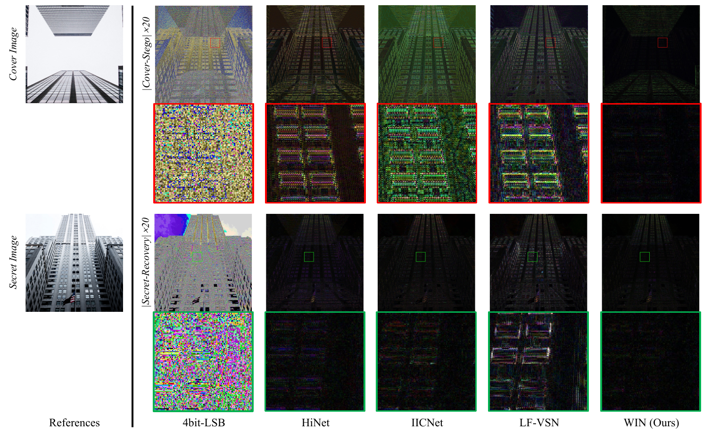
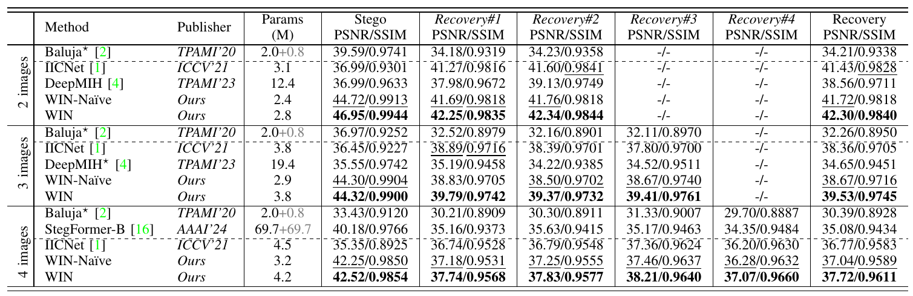
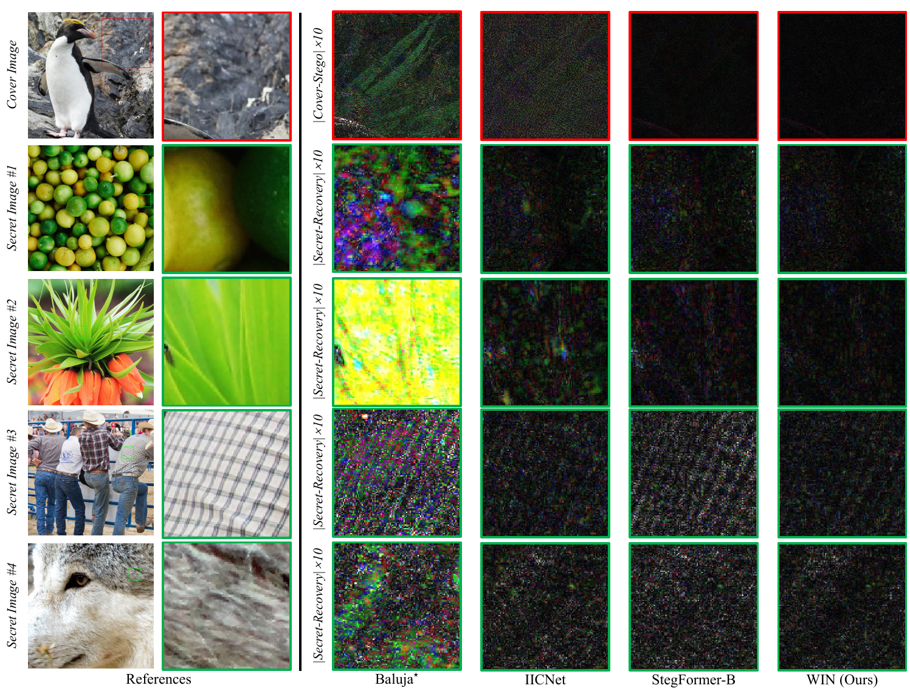
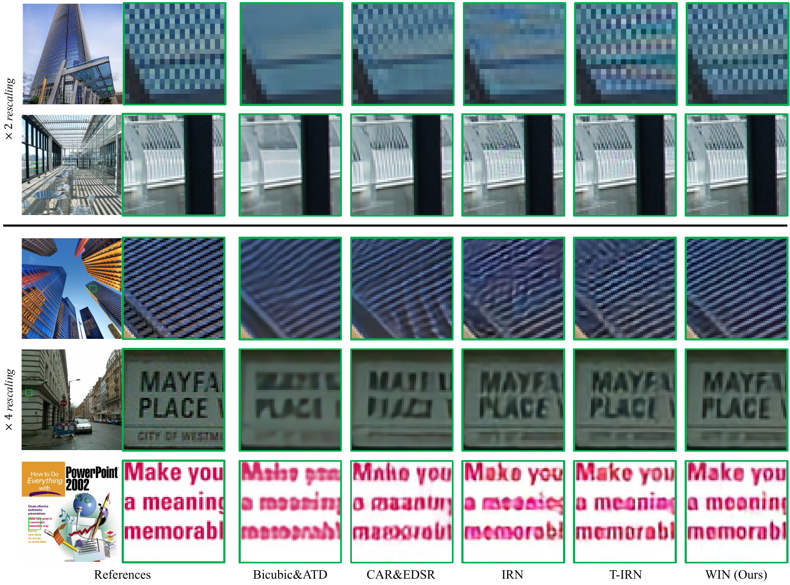

# Well-Posed Invertible Network (WIN) for Reversible Image Conversion

Official PyTorch implementation of **"Tackling Ill-posedness of Reversible Image Conversion with Well-posed Invertible Network"**.

This repository provides a unified framework for multiple reversible image conversion (RIC) tasks including **reversible image hiding**, **image rescaling**, and **reversible image decolorization**.

---

## 🔥 Highlights

- **Well-Posed Design:** Invertible operations with theoretical guarantees
- **High Performance:** State-of-the-art results on benchmark datasets

---

## 📁 Project Structure
```  
├── main.py                 # Entry point for training/testing  
├── train.py               # Training and validation loops  
├── model.py               # WIN and WIN-Naive architectures  
├── option.py              # Command-line argument parser  
├── utils.py               # Utility functions (metrics, I/O, etc.)  
├── config/                # YAML configuration files  
│   ├── hiding_WIN_x1.yaml  
│   ├── rescaling_x4_WIN.yaml  
│   └── decolorization_WIN.yaml
│   └── ...
├── data/                  # Data loaders and preprocessing  
│   ├── dataloaders.py  
│   └── common.py  
├── src/                   # Core modules  
│   └── basic_module.py   # INN blocks, WIC, WICM modules  
└── pretrained_checkpoints/ # Pre-trained model weights  
│   ├── hiding_WIN_x1.pth  
│   ├── rescaling_x4_WIN.pth  
│   └── decolorization_WIN.pth
│   └── ...
```

## 📊 Datasets
Place your datasets in the following structure:
```
Datasets/
├── Train/
│   └── DF2K/              # Training set (DIV2K + Flickr2K)
└── Test/
    ├── Set5/HR/
    ├── Set14/HR/
    ├── Urban100/HR/
    └── DIV2K_Valid/HR/
    └── Kodak24/HR/
```

## 🚀 Quick Start
### 1️⃣ Training
#### Example 1: Image Hiding (1 secret)
```
python main.py --task hiding --method WIN --num_secrets 1 --train train
```
#### Example 2: Image Rescaling (4×)
```
python main.py --task rescaling --method WIN --scale 4 --train train
```
#### Example 3: Decolorization
```
python main.py --task decolorization --method WIN --train train
```
### 2️⃣ Testing
#### Test with pre-trained model
```
python main.py --task hiding --method WIN --num_secrets 1 --train test
```
The script will automatically load the checkpoint from:
```
pretrained_checkpoints/hiding_WIN_x1.pth
```
#### Save output images
```
python main.py --task hiding --method WIN --num_secrets 1 --train test --save_img
```
### 3️⃣ Model Complexity Analysis
```
python main.py --task rescaling --scale 4 --train complexity
```
This will output: Parameters (K) and FLOPs (G) for both forward and reverse passes

## 📦 Pre-trained Models
Download pre-trained checkpoints from Google Drive. Place them in [**pretrained_checkpoints**](https://drive.google.com/drive/folders/1i71o6Eo6ugPAl7rvpn8bFfKOR5_5FQs5?usp=drive_link).

## 📈 Results
Quantitative comparisons of different single image hiding methods on multiple benchmark datasets.

Qualitative results of reversible single image hiding: hiding secret in smooth cover image. For better view, we visualize the residual error map in the forward concealing branch (the top two rows) and the reverse revealing branch (the bottom two rows).

Quantitative comparisons of multiple image hiding methods with different number of secret images on DIV2K validation dataset.

Qualitative results of reversible multiple image hiding with four secret images. The residual error maps are visualized for improved clarity.

Quantitative comparisons of different image rescaling methods on several benchmark datasets. The PSNR and SSIM metrics for the accuracy of image upscaling on downscaled image are provided.

Qualitative results of reversible image rescaling.


## 📜 Citation
If you use this code or find our work helpful, please cite:
```
@article{huang2025tackling,
  title={Tackling Ill-posedness of Reversible Image Conversion with Well-posed Invertible Network},
  author={Huang, Yuanfei and Huang, Hua},
  journal={arXiv preprint arXiv:2508.02111},
  year={2025}
```
